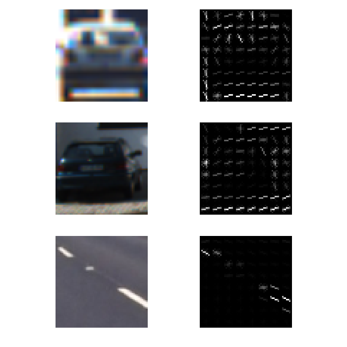
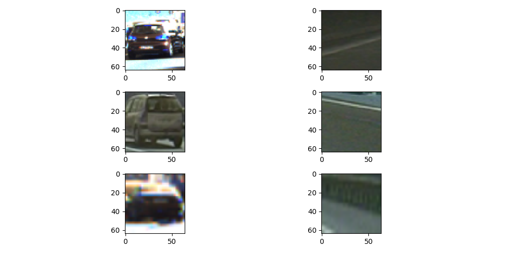
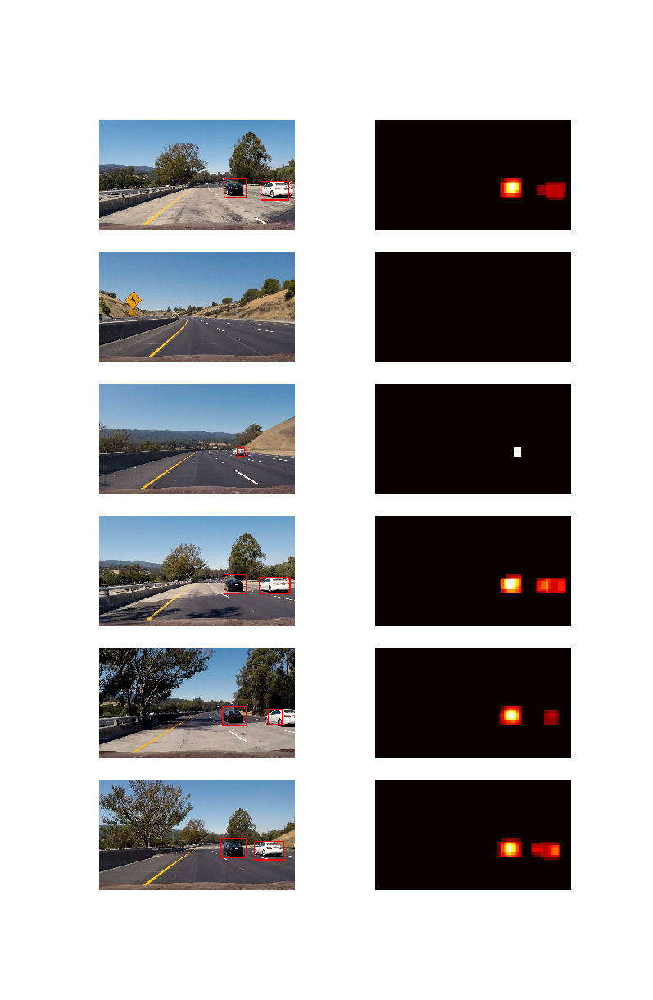

**Vehicle Detection Project**

The goals / steps of this project are the following:

* Perform a Histogram of Oriented Gradients (HOG) feature extraction on a labeled training set of images and train a classifier Linear SVM classifier
* Optionally, you can also apply a color transform and append binned color features, as well as histograms of color, to your HOG feature vector. 
* Note: for those first two steps don't forget to normalize your features and randomize a selection for training and testing.
* Implement a sliding-window technique and use your trained classifier to search for vehicles in images.
* Run your pipeline on a video stream (start with the test_video.mp4 and later implement on full project_video.mp4) and create a heat map of recurring detections frame by frame to reject outliers and follow detected vehicles.
* Estimate a bounding box for vehicles detected.

### Project Structure
The main project file `vehicle_detection.py` contains the pipeline for this project. I defined three functions `train_svm`,`process_test_images` and `process_video()` to carry out the corresponding tasking. All the suporting functions are included in a separate `helper.py` file. 

### Histogram of Oriented Gradients (HOG)
The scikit-image package has a built in function to extract Histogram of Oriented Gradient features. The code for this step is contained in lines 16 -33 of my `helpers.py` file.

I then explored different `skimage.hog()` parameters (`orientations`, `pixels_per_cell`, and `cells_per_block`).  I grabbed random images from each of the two classes and displayed them to get a feel for what the `skimage.hog()` output looks like.

Here is an example using the `YCrCb` color space and HOG parameters of `orientations=9`, `pixels_per_cell=(8, 8)` and `cells_per_block=(2, 2)`:

#### Explain how you settled on your final choice of HOG parameters.
It's an art to choose parameters for HOG.  I explored various combinations of hogchannels, spatialsize, orientation and color space for training the classifier. 
My final parameter settings are 

    COLOR_SPACE = 'YCrCb'  # Can be RGB, HSV, LUV, HLS, YUV, YCrCb
    ORIENTATION = 9  # HOG orientations
    PIX_PER_CELL = 8  # HOG pixels per cell
    CELL_PER_BLOCK= 2  # HOG cells per block
    HOG_CHANNEL = "ALL"  # Can be 0, 1, 2, or "ALL"
    SPATIAL_SIZE = (32, 32)  # Spatial binning dimensions
    HIST_BINS = 32  # Number of histogram bins
    SPATIAL_FEAT = True  # Spatial features on or off
    HIST_FEAT = True  # Histogram features on or off
    HOG_FEAT = True  # HOG features on or off
    
This works well with sliding window search with 3 different scales : 1.0 / 1.5 / 2.0 over a window of 64.

#### Describe how (and identify where in your code) you trained a classifier using your selected HOG features (and color features if you used them).
Labeled images of cars and non-cars are used for training a SVM. The traning dataset can be found [here](https://github.com/udacity/CarND-Vehicle-Detection). These example images come from a combination of the GTI vehicle image database, the KITTI vision benchmark suite, and examples extracted from the project video itself. Below are some examples demonstrating the training dataset. Left side shows `cars` images, while the right sides shows `non-cars`.

The code for this task is located in line 84-137 of `vehicle_detection.py`.The feature vector is quite large: all features that the pipeline provided (Spatial, Histogram and Hog features) were used. This feature list was chosen because it yields satisfying results, and there is no clear justifications to prefer one feature than another. 
The trained results are saved/'pickled' to a `svc_data.pickle` file for easy retrieval of parameters in late stages.

### Sliding Window Search
To search for cars in larger images, sliding window search is utilized. The implementation can be found in line 102-168 of `helper.py`.
Multiple searches were carried out using 1, 1.5, and 2.0 scales.

### Filtering & Heat Maps

The positions of positive detections was saved in each frame of the video.  From the positive detections I created a heatmap and then thresholded that map to identify vehicle positions.  I then used `scipy.ndimage.measurements.label()` to identify individual blobs in the heatmap.  It's assumed that each blob corresponded to a vehicle.  I constructed bounding boxes to cover the area of each blob detected.  

Below are some output images applying this method on the provided test images. On the left, the original images was marked with bounding boxes, and on the right, the corresponding heat map is plotted.

---

### Video Implementation

Here's a [link to my video result](./project_video_out.mp4). The code is located at line 139-178 in `vehicle_detection.py`.

The procedure is similar to that of processing test images. Instead of output two images (`draw_img` where bounding boxes are drawn, and `heatmap`), only one image `draw_img` is returned. 

### Discussion

Size of the training dataset did impact the detection results. Initially, I only used a small subset of the trainig data provided, and they yield many false positives. I then used the full set of training data (labeled 'cars' and 'non-cars' images from various sources), and the recognition result is much better. Anothe observation is that darker cars seems harder to detect. 

One possible improvement to the current implementation would be saving the bounding box sizes and use that as a prior info when estimating the location of cars at later time. 
